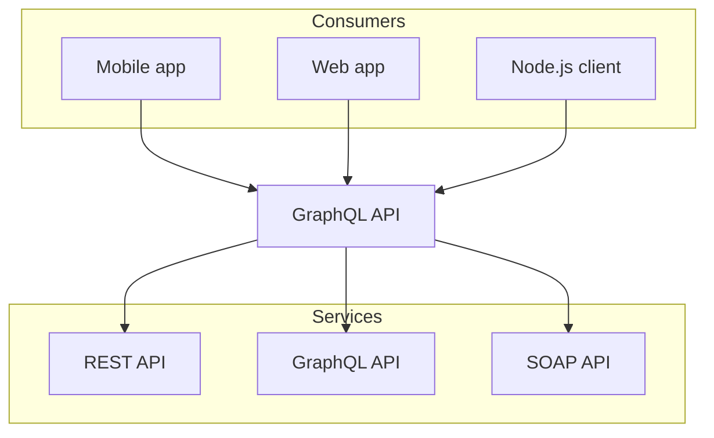

# unpredictableFate v2

Writter: `简律纯`

这是 unPF v2 版本的发行概述，主要是介绍一下网站的变化。

### Components

新增了一些React组件，如下:

1. Cards

import { Cards, Card } from 'nextra/components'
 
<Cards>
  <Card title="v2 新版本" href="/docs/latest" />
  <Card title="v1 旧版本" href="/docs/v1/advanced/core" />
</Cards>

``` tsx copy showLineNumbers
import { Cards, Card } from 'nextra/components'
 
<Cards>
  <Card title="v2 新版本" href="/docs/latest" />
  <Card title="v1 旧版本" href="/docs/v1/advanced/core" />
</Cards>
```


2. FileTree

import { FileTree } from 'nextra/components'
 
<FileTree>
  <FileTree.Folder name="pages" defaultOpen>
    <FileTree.File name="_meta.json" />
    <FileTree.File name="contact.md" />
    <FileTree.File name="index.mdx" />
    <FileTree.Folder name="about">
      <FileTree.File name="_meta.json" />
      <FileTree.File name="legal.md" />
      <FileTree.File name="index.mdx" />
    </FileTree.Folder>
  </FileTree.Folder>
</FileTree>

``` tsx copy showLineNumbers
import { FileTree } from 'nextra/components'
 
<FileTree>
  <FileTree.Folder name="pages" defaultOpen>
    <FileTree.File name="_meta.json" />
    <FileTree.File name="contact.md" />
    <FileTree.File name="index.mdx" />
    <FileTree.Folder name="about">
      <FileTree.File name="_meta.json" />
      <FileTree.File name="legal.md" />
      <FileTree.File name="index.mdx" />
    </FileTree.Folder>
  </FileTree.Folder>
</FileTree>
```

3. mermaid



```` markdown

````

4. latex

The **Pythagorean equation**: $a=\sqrt{b^2 + c^2}$.

``` markdown
The **Pythagorean equation**: $a=\sqrt{b^2 + c^2}$.
```

### Blog

先上班， 下班再写。


### SiteMap

先上班， 下班再写。