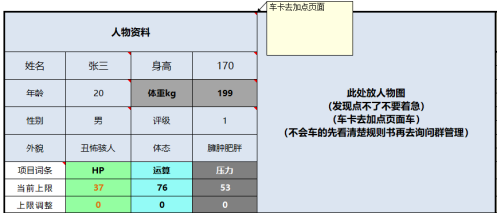

### 人物资料

首先，玩家应制作创建期望的人物形象，填写人物的资本资料，具体如下表
注意，属性的填入在表格第二页【加点页面】这里仅做结果展示。

看到格子上面那个角没有，鼠标移过去或者手机点一下就能看到，大部分大家都懂的东西，我就不在这里多做废话了。（或者下次更新的时候，让其他冤大头帮我写一下）

- **外貌** ：对应你的性别+app属性，仅代表你的脸
- **体态** ：由你的身体属性加成所决定，偏差过大会导致竹竿或者臃肿身材（强度党当我没说）
- **评级** ：评级随着你跑团数和跑团结局决定，每一次评级提升都会带来实力的提升。
- **压力** ：可以对标一下coc里面的san检定

