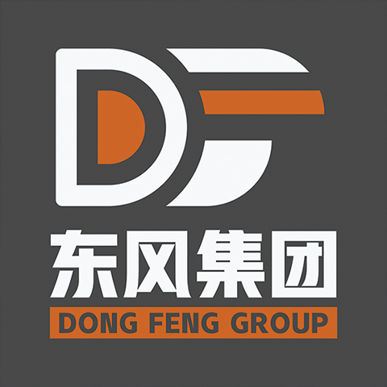

# 都灵大势力
import { Callout } from 'nextra-theme-docs'
import { Tab, Tabs } from 'nextra-theme-docs'
import { Steps } from 'nextra-theme-docs'

而因为天时地利以及人和等各种原因，都灵形成了一种十分罕见的体制，其体制被命名为“联合统治”。意味，都灵的统治权力是被多数的掌权者联合掌握的。

## 都灵政府

结构体系（属于直辖类型）

<Steps>

### 都灵权力机关——最大都灵立法所

都灵的立法机关，负责创建以及颁发都灵的各项法案。（宪法，法律，道德模范，等等）

### 都灵统治机关——最大都灵法院

都灵次级统治机关————都灵各级街区审判厅（负责接收警署抓到的犯人，审判并处理犯人的各项罪案）

### 都灵监察机关——最大都灵监察所

都灵次级监察机关——都灵各级街区监察所（都灵各级街区审判厅将审批后的罪案移交给各级街区监察所，各级街区监察所将会根据法案，对其罪案进行定罪。与都灵各级街区审判厅是连体关系。）

</Steps>

## 国家异常事务局

> 【异能局】【国异局】

直属于政府管辖，是对一切异常现象进行研究、观察、解决的部门，其又细分为三大机关，威胁处理机关，平衡观察机关和异常研究机关，各个部门分工明确

<Steps>

### 威胁处理机关

异能局中唯一的暴力机构，一般由拥有强大个人执行能力的单位组成，通常会被调往世界各地参与解决一些警署无法处理的异常威胁，

### 平衡观察机关

异能局的眼睛，监控着世界的异常现象，发出预警，做出调控，辅助威胁处理机关处理异常。

### 异常研究机关

异能局的核心，掌握着世界上最先进的异常知识，能够熟练分析各种异常事件并且给出解决方案，大部分的异能科技皆出于此。

</Steps>

## 异常危机管理局

> 【PCMB】【核弹库（戏称）】

前【都灵特殊监狱】，现为管理【威胁性异能者】的特殊管理局，主要收押主观威胁人类人身安全以及异能本身会对人类社会造成巨大危害的异能者。

异能危机管理局为第一个尝试以“异能者”治理“异能者”的官方管理局。虽说名称变得好听了一些，但本质上仍旧为都灵用于关押异能者罪犯的特殊监狱。

## 都灵利益联合体

> 【都灵联合】【公司】

都灵政府在迁徙城市后，仍旧保留了小部分资料和资源，但是在外忧内患的状态下无力在形成政府集权的状态，所以邀请各大同样保有实力的企业势力联合组建。

都灵利益联合体是都灵新城重建的主要推力，拥有全都灵最多的生产资料和相关资源。

## 军部

> 【洗地机】

是一个极其拥有凝聚力的组织，直属于最高政府，用于威慑镇压地方政权的一切威胁势力，配合异能局处理大规模性质的异常事件。

其内部分为：办公厅/联合参谋部/政治工作部/后勤保障部/装备发展部/训练管理部/纪律检查部/战略规划部/审计署/军营

其中军营位于都灵最大的第六环/第六街区，其他核心部门皆位于第一环/第一街区

<Tabs items={['办公厅', '联合参谋部', '政治工作部', '后勤保障部', '装备发展部', '训练管理部', '纪律检查部', '战略规划部', '审计署', '军营']}>
    <Tab>
   用于军部对外联络和沟通事宜，以及非军部人员接待
  </Tab>
   <Tab>
   作战指挥/军事统筹/指定行动方针
  </Tab>
   <Tab>
   汇集，统计，调查，都灵各个街区的管理情况。以及异常，违法异能者，邪恶组织等各种突发事件
  </Tab>
    <Tab>
    物资采购/物资管理/辅助其他部门功能运转
  </Tab>
     <Tab>
    装备研发/装备维护/装备测试
  </Tab>
     <Tab>
    部队训练/实战演戏
  </Tab>
     <Tab>
    监督检查其他部门违法违纪以及工作落实等实际情况的部门
  </Tab>
     <Tab>
    拟定计划及提供战略建议的部门，计划执行前提供作战计划，计划执行中提供即时战略建议
  </Tab>
     <Tab>
    管钱的
  </Tab>
     <Tab>
     军部任务下达终端/军部资产调用执行管理  
    派遣部队，管理部队，通过政治工作部派发的指令，镇压/摧毁/缴获异常及异常衍生物，其中也包括非法异能者。
    <Tabs items={['突击部', '支援部', '后勤部', '医疗部']}>
        <Tab>
        **主力作战部队**  
        Shock worker突击手  
        编号为SW  
        <Callout type="info">
            **参考**  
            莉莉丝 作为突击部第二十一位新进人员，则被安排到了突击部第三科七班二组的第二十一位，也就是 军部编号：SW3721
        </Callout>
        </Tab>
         <Tab>
        **负责支援突击部的辅助部门**  
        designated marksman神射手  
        编号为DM  
        </Tab>
         <Tab>
        **负责资源运输和管理的部门**  
        Army Logistician后勤保障人员  
        编号为AM  
        </Tab>
        <Tab>
        **军部医疗部门，主要负责战时治疗支援**  
        medical officer医疗单位  
        编号为MO  
        </Tab>
    </Tabs>
  </Tab>
</Tabs>

## 警察署

> 【警察局】【警署】

全称警察署，警署内部结构为5块：刑警队、治安队、综合科、社区警务，特别行动科。警署体制既保证了公安基础工作，又加强了公安专业力量。专业部门的刑事侦查、治安管理等工作已经延伸到公安部门的最基层单位；与此同时，警力向基层倾斜，确保了一方平安。

## 异能者与人类管理局

可以直接理解为和事老或者居委会大妈

  
  
  

# 私人势力

## 教会

曾经某个国家整合出来的神学教会，信仰的是会拯救一切的主“爱莉希雅”

**教会的最高执掌人员**

教皇：克兰斯里蒂.冯.弗里斯塔尔（本任）

**仅次于教皇的内部神职者。**

圣女：海薇尔.优芙兰娜

**教会外派都灵事物处理人**

打工人 ：罗曼尼（PL）
被教会派遣到都灵以协助发展的名义和都灵官方势力达成合作，目前在二环积极发展中

## 泰坦重工

主要重型大型设备的研发和生产，和军部签署了长期战略合作歇息，是官方重要设施和武器的核心供给企业

## 燧王科技

复合型科技企业，主要业务是收集都灵旧址内的残留科技资料，复现或者研发符合需求的新科技产品。虽然进度极其缓慢，但是每次推出的核心产品都能引发一场科技地震。

## 博益医疗

主打科技医疗产品的企业，但是真正核心的产品是异常衍生物相关的医疗研发，包含但不限于生物组织再生/克隆器官/异常器官移植等一些违背人伦但非常好用的技术研发。

## 东风集团 （PL：闹钟）

东风集团由黄道先生和左季谷先生合伙创办，是致力于各式送货服务的大型企业集团，为都灵区块的客户们提供高品质高速度的服务。

> 关于子公司

包括但不限于东风外卖、东风特快、东风拉货、东风搬家，但只有东风外卖没有固定的办公地点，其他子公司在都灵的各个社区都有分部
子公司之一的东风特快是东风集团唯一主动招募异能者的公司。

## 荒原野草

并不是对某一势力的称呼，而是那些游离于城市之外的所有势力统称，他们不再信任城市和科技，但是又不得不依附社会和其带来的生产力，所以一直保持着和城市之间若即若离的管理，而对于都灵政府而言，他们也需要这些犹如野草一般，百折不挠，烧之不尽，吹之又生的“垃圾佬”帮他们收集那些不方便获得的资源和遗失在外的资料。

## 黑森林事务所（PL：利斯特）

势力分部广泛，警署、军部等官方势力都有关系。事务所内人员多样，从女仆、侦探、战斗员到心理医生都有。虽然并不是利斯特本人的意思，但是似乎事务所内的员工和有关的人的名字里都有一个与草或木有关的名字。苍南白，叶小小，叶依言，云梦，缪卡莎，柳，艾希......
