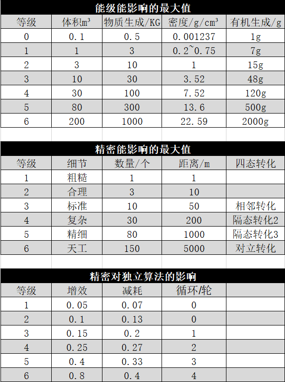

## 附录B：数据参考
import { Callout } from 'nextra-theme-docs'
import { Tab, Tabs } from 'nextra-theme-docs'
import { Steps } from 'nextra-theme-docs'

**能级参考（不包含算法影响、仅供参考）**

<Tabs items={['0级', '1级', '2级', '3级', '4级', '5级', '6级']}>
  <Tab>
    `造成伤害：0.99`      `增加伤害：0.99`
    
    `造成防御/减伤：0.99`  `增加防御/减伤：0` 

    `短期治愈：0`         `长期治愈：d0.99`

    `固定挑战难度：0`      `逐级累加挑战难度上限：0.99`

    `加减骰：0`            `加减骰上限：0`   

    `加减成功点数：0`      `加减成功点数上限：0`  

    `固定hp：2`           `常规护甲：0`  
  </Tab>
    <Tab>
    `造成伤害：d2`         `增加伤害：1`
    
    `造成防御/减伤：1`     `增加防御/减伤：0` 

    `短期治愈：1 `         `长期治愈：d2`

    `固定挑战难度：1`      `逐级累加挑战难度上限：1.8`

    `加减骰：0.99`        `加减骰上限：7`   

    `加减成功点数：0`      `加减成功点数上限：5`  
    
    `固定hp：5`           `常规护甲：0`  
  </Tab>
   <Tab>
    `造成伤害：d3`         `增加伤害：1.6`
    
    `造成防御/减伤：2`     `增加防御/减伤：1` 

    `短期治愈：d2`         `长期治愈：d3`

    `固定挑战难度：1.6`    `逐级累加挑战难度上限：2.7`

    `加减骰：1.6`         `加减骰上限：8`   

    `加减成功点数：0.6`    `加减成功点数上限：7`  
    
    `固定hp：12`           `常规护甲：0`  
  </Tab>
   <Tab>
    `造成伤害：d6+1`        `增加伤害：d3`
    
    `造成防御/减伤：4`      `增加防御/减伤：2` 

    `短期治愈：d3`          `长期治愈：d6`

    `固定挑战难度：2`       `逐级累加挑战难度上限：4`

    `加减骰：2`             `加减骰上限：12   

    `加减成功点数：1`       `加减成功点数上限：11` 
    
    `固定hp：18`           `常规护甲：0.99`  
  </Tab>
    <Tab>
    `造成伤害：2d4+1`       `增加伤害：2d2`
    
    `造成防御/减伤：8`      `增加防御/减伤：4` 

    `短期治愈：d4+1`        `长期治愈：d9+2`

    `固定挑战难度：3`       `逐级累加挑战难度上限：5`

    `加减骰：2.6`           `加减骰上限：14`   

    `加减成功点数：1.6`     `加减成功点数上限：13` 
    
    `固定hp：28`           `常规护甲：1.43`  
  </Tab>
    <Tab>
    `造成伤害：2d6+4`      `增加伤害：2d3+2`
    
    `造成防御/减伤：12`     `增加防御/减伤：6` 

    `短期治愈：2d2+1`       `长期治愈：2d6+2`

    `固定挑战难度：4`       `逐级累加挑战难度上限：7`

    `加减骰：3`            `加减骰上限：16`   

    `加减成功点数：2.4`     `加减成功点数上限：14` 
    
    `固定hp：48`           `常规护甲：2.4`   
  </Tab>
   <Tab>
    `造成伤害：3d8+10`      `增加伤害：3d4+3`
    
    `造成防御/减伤：20`     `增加防御/减伤：10` 

    `短期治愈：2d5+2`       `长期治愈：3d8+4`

    `固定挑战难度：5`       `逐级累加挑战难度上限：9`

    `加减骰：4`            `加减骰上限：20`   

    `加减成功点数：3`     `加减成功点数上限：18` 
    
    `固定hp：88`           `常规护甲：4`  
  </Tab>
</Tabs>

### 精密度参考

关于化形或制作的精密等级

<Tabs items={['无', '粗糙', '合理', '标准', '复杂', '精细', '天工']}>
  <Tab>
   字面意思，你什么都做不了口也，只能根据原理做到最最简单的反应，比如蠕动一下啥的

   通过该精密等级收集到的信息，大概可以参考傻子说话或者1kb每秒
  </Tab>
    <Tab>
   简单且极其粗糙的形状变化，非常的不规则，但是至少可以做到极其有限的约束
   能够做出一些拥有大致形状，并且十分难以利用的东西，从游戏的角度理解就是做出来的东西使用的话会-2骰

   通过该精密等级收集到的信息，转化为文字的话，至少是能够保证通顺阅读的，但是内容精准程度不做保证
  </Tab>
   <Tab>
   能够做出一些正常的基础的工业化工具，只能说保证使用，但是不美观，如正方体，刀剑，盾牌，这些东西只能保证使用，没有任何其他特殊效果。

   通过该精密等级能够保证，在效果范围内拥有最基本的外置器官的效果
  </Tab>
   <Tab>
  基本上常规的工厂流水线制作的东西都可以实现，能够保证多次制作的东西相互嵌合运转，不会产生5mm以上的精密误差，谁要是用这个说自己能做芯片，我就拧断他狗头！！！

  在该精密等级，符合异能原理的信息收集，已经不需要借助测量道具，也能获得准确的答案。

  可以生成一些不是很复杂的器官，如肌肉，脂肪，皮肤，骨骼，角质，或者不包含实际功能的内脏和五官器官
  </Tab>
    <Tab>
   能够完成更加复杂的加工工作，接近专业的生产流水线器械，十分精准，不会产生1mm以上的精密误差

   不管多复杂的宏观信息在你面前都无处遁形，当然也仅限于宏观信息

   可以生成一些包含实际功能的较大的复杂的器官，如五脏六腑，或者耳、口、喉、鼻
  </Tab>
  <Tab>
  在材料允许的情况下，可以完成误差不超过1μm超精工业加工，在运算允许的情况，你甚至可以徒手搓一套战斗机甲

  对于信息的处理精度，堪比4090ti，你甚至可以在复合材料里迅速锁定某种单一分子结构

  可以生成一些较小的，但依旧属于宏观状态的器官，如眼球、舌头、神经、骨髓等等
  </Tab>
  <Tab>
  纳米级别的操作能力，惊为天人，信息处理能力堪比超算电脑，拥有相应的知识你甚至可以手搓芯片，或者1:1复刻还原某事某物
  </Tab>
</Tabs>

  

  

### 能级和精密度可影响最大值参照表

### 数值相关描述注意

<Steps>

### ±1
就是直接在骰点的成功点数上进行±1

### ±1骰
就是直接在骰子总数上获得±1个骰子

</Steps>

