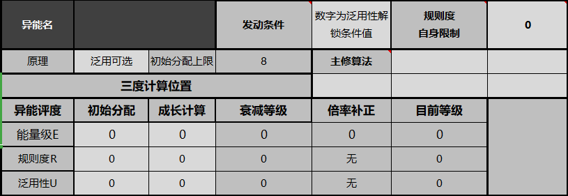

# 异能
import { Callout } from 'nextra-theme-docs'
import { Tab, Tabs } from 'nextra-theme-docs'
import { Steps } from 'nextra-theme-docs' 

**写在最前面！！！所有异能均不可直接影响生命内部！！！**

**角色卡中属于每个角色的专属能力，分为战斗描述和非战斗描述**

<Callout type="info">
异能不是游戏里的技能，而是一种特定且指定的具体【能力】。所有的【能力】都仅限于对【某个】物理法则的改变，哲学、神秘学、自我中心乃至于法则系的类别也一定要找到符合的物理规律才能够实现。
</Callout>

- 【战斗描述】必须要有精准的数值和效果介绍，没写的效果就是没有
- 【非战斗描述】根据描述内容进行一定程度上宽泛化处理，具体程度视IO自身决定，或者双方友好商谈后，决定。如果可能实现但是实现困难就需要进行[超能挑战检定](../power#超能挑战)。

## 异能三分

<Callout type="info">
**【能量级】**
</Callout> 

  - 消耗：消耗就是你滋水的时候用的力气
  - 能级：能级就是你一次滋水的量，别人【水炮】，你【水枪】
  - 射程：射程很简单把，就是你尿…………咳，滋水可以滋多远的问题
  - 效率：效率就是相同滋水量的情况下，你滋要1s还是要1min的问题

<Callout type="info">
**【规则度】**
</Callout> 

  - 算法数：咳…………就是分叉可以分几道的意思
  - 算法：就是你滋每一道可以整什么样的花活，比如滋雾滋冰块啊，什么气液固等离子态啥的
  - 维持上限：就是可以尿…………滋多久
  - 精密度：就是你滋出来的是普通的水流还是音乐喷泉

<Callout type="info">
**【泛用性】**
</Callout> 

  - 复杂度：滋的是普通的水还是带结石的还是黄的绿的青的七彩的
  - 发动条件：用水枪滋水还是其他身体部位滋水还是虚空滋水
  - 开发程度：滋水的方式一共有几种，可以参考一下公共厕所的尿尿姿势海报哦~

 **所有玩家开局只有1个技能** ，开发程度是你拥有技能的上限，不是开局技能

**其次，请注意！**

在精密度和复杂度这一块，当你使用异能进行一些复杂行为操作的时候，必须要有对应的职技，在职技的帮助下，你才可以进行一些常规情况难以做到的事情

↓↓↓↓↓↓↓注意异能原理，算法，数据相关的，从这里跳转↓↓↓↓↓↓↓↓

[**附录A：原理和算法参考目录**](../appendix/a)  
[**附录A：原理和算法参考目录**](../appendix/a)  
[**附录A：原理和算法参考目录**](../appendix/a)  
[**附录A：原理和算法参考目录**](../appendix/a)  
[**附录A：原理和算法参考目录**](../appendix/a)  

[**附录B：数据参考**](../appendix/b)  
[**附录B：数据参考**](../appendix/b)  
[**附录B：数据参考**](../appendix/b)  
[**附录B：数据参考**](../appendix/b)  
[**附录B：数据参考**](../appendix/b)  

↑↑↑↑↑↑↑注意异能原理，算法，数据相关的，从这里跳转↑↑↑↑↑↑↑

## 异能的外在表现
异能的生效意味着对这个世界正常客观规律的改变，这种强行的改变必然会引起客观规律的冲突，而这种冲突形成的可被观察到的变化，就是异能的外在表现，

- 异能的外在表现和发动条件有关
- 异能的外在表现表征的强弱和该异能者的规则度有关，规则度越高的人越可以自由控制异能发动时的外在表现
- 侦查异能外在表现的难度等于该异能者的规则度，如此人规则度为1，则侦查他异能表征所需要的挑战难度即为1

<Steps>

### 发动条件
- 接触：会在用于接触的器官（如手足皮肤）处产生变化
- 媒介：会先在用于接触触发媒介的器官（如手足皮肤）处产生变化，然后在媒介上产生变化
- 感知：会在对应的感知器官（如视听触等）处产生变化
- 认知：仅在瞳孔处有对应变化

### 能量影响
异能原理导致技能效果具有能量表现，如动能，热能，电能等，会在相关的发动条件上表现出对应的变化，如细微的风声，过热导致的空气密度不均匀（扭曲），或者电流声等等。

### 物质影响
异能原理导致技能效果是生成物质，控制物质，或者生成器官，器官变化之类的，会在相关发动条件上表现出对应的变化，如短时间同化成原理相关物质，器官蠕动等等

### 概念影响
异能原理或算法导致技能效果受到概念影响时，会在相关发动条件上呈现一定程度的光影效果，光影颜色和常人对该概念理解的颜色接近

### 信息影响
异能原理或算法导致技能效果为信息类效果影响时，会在相关发动条件上，产生轻微的违和感和撕裂感，如无对应的侦查机制，则需要侦查的难度+1

### 特殊原理
异能原理为特殊时，异能无外在表征，因为特殊原理的异能一定是先成功改造范围内客观规律，而后才生效的，生效效果为绝对

</Steps>

## 异能的车制辅助

通过异能卡中的数据参考，与该规则书附录，可以获得绝大部分的数据参考与信息。

首先，这里是异能参考表，位于角色卡最后一页，表格上第一排是你可以通过异能购点获得的等级，一共有三项，分别是能量级E，规则度R，泛用性U

然后让我们回到主页异能表

**所有浅灰色的格子，都是可以自动调整的，其他的都是自动化表格**

首先看第一行

<Tabs items={['原理', '初始分配上限', '发动条件', '规则度自身限制']}>
  <Tab>
 原理可以在下拉菜单找到你之前选择的[原理](../appendix/a#异能原理)，这个代表你的异能核心原理，所有的异能效果都以此为基础展开应用。
 你可以将原理简单理解为，你的异能作用对象的区间
  </Tab>
    <Tab>
   然后是初始分配上限，所有新卡可以自由分配的点数都为8点，可以在下方三度计算表的位置进行自由分配。
  </Tab>
   <Tab>
   右侧的发动条件是自选异能发动方式，只有泛用性等级达到了才能选用更高级的发动方式，其他情况下可以通过降低发动条件提升异能效果。
  </Tab>
   <Tab>
   对规则度带来的收益需求不高的小伙伴，可以自行降低规则度来换取更强的异能效果，你在这里选择了几，那么你的真实规则度就是几，同样只可向下兼容
  </Tab>
</Tabs>

【主修算法】
这里决定了你异能技能可以选择的算法，IO将通过算法判定你技能指令的合理程度

<Tabs items={['初始分配', '成长计算', '衰减等级', '目前等级', '倍率补正', '综合评级']}>
  <Tab>
  在上一栏显示的八点分配点数，根据你在表格上自选的点数填入这里，而泛用性，是根据你选择的原理固定的，例如【概念体】泛用性就是4~5，你可以选择4点也可以选择5点，不过4点的情况你发动条件最高就是感知，5点的情况下，你发动条件最高是认知
  </Tab>
    <Tab>
   后续通过跑团获得的成长点数填入这里        
  </Tab>
   <Tab>
   你要是倒霉开发异能大失败或者跑团过程中受到对应的伤害，扣除的规则度填这里      
  </Tab>
   <Tab>
   就是你异能配点的最终等级了        
  </Tab>
    <Tab>
    可以通过限制自己的规则度换取能量级的倍率补正，限制越大，补正越高。      
  </Tab>
  <Tab>
    通过异能三分配点计算决定你的异能评价等级        
  </Tab>
</Tabs>

关于这里，简单来说就是字面意思，不用特别解释  
**唯一一点需要注意的是**  
**车制技能对应的属性最大值，不能超过这里**

然后到技能栏

浅灰色的位置，就是可以通过下拉菜单自选的属性，这些将决定这里剩余3个格子的效果
很容易理解的就是，效果越强，消耗越高，不过要记得上面这句，你在这里填入的属性，不能超过蓝色框框里的属性。
这里解释一下这几个格子的意思

<Tabs items={['启动消耗', '能级', '发动距离', '发动速度', '精密度', '维持时间']}>
  <Tab>
  你开启异能所需要的运算    
  </Tab>
    <Tab>
   你异能能量放出的程度    
  </Tab>
   <Tab>
   异能-技能的最大直接生效距离    
  </Tab>
   <Tab>
   你从开始使用技能到技能完全生效所需要的时间    
  </Tab>
    <Tab>
    你对异能和异能造成影响的控制程度    
  </Tab>
  <Tab>
    开启异能后，你可以使用技能的合计时间，超过这个时间就需要重新开启  
  </Tab>
</Tabs>

- 【算法-指令】在[《附录A:原理和算法参考目录》](../appendix/a#算法)
- 算法指令是由技能源码和算法组合而成，而技能源码指的是你这个技能的核心算法，后续搭在的所有的算法都是基于该核心算法生效的，当后续添加的算法和核心算法无法关联的时候，则该算法不生效。反之也是一样，当核心算法无法生效的时候，后续添加的其他算法也无法生效。
   <Callout type="info">
    **示例**
   原理：器官强化  
   原理描述：通过异能强化自己的指甲  
   一技能：  
   源码：结构  
   算法1：物质转化  
   算法2：形变操作  
   效果：将指甲向更尖锐的方向形变，并且增加其密度和硬度。  

   二技能  
   源码：升维转化  
   算法1：位移操作  
   算法2：有机生成  
   效果：升维指甲撕裂的概念，控制其射出，使被命中的角色更容易被撕裂出血。射出后可选择是否再次生成指甲。  
   </Callout> 

- 【使用消耗】就是通过指令使用异能时所需要的额外运算消耗，我们可以在车卡的时候，根据自己选择的算法，填入你期望的能级和精密度，获取具体的运算消耗，然后加入到这里。

## 异能提升与强化

**异能开发期间压力不可被任何情况影响，该条规则为绝对词条**

异能即为意志改变世界，因此异能的开发就是一个挖掘自身，拓展自身的过程。在心理学上，人格结构分为几个层次，其中欲望对应能量级，自我对应规则度。但除了发掘自身，寻求知识，拓展见识，也是提升规则度的方法，求诸与外亦或求诸于内，都是人类作为异能者的提升。

<Callout type="info">
**【规则度】**
</Callout> 

（开局自带职技必须进行两次职技≥3的骰点才能激活对应规则度加点）
可以提升规则度的职技最多为2个！

<Steps>

### 客观现实/物质影响类异能提升
  通过对应知识类型职技  
  **每4点知识类相关职技提升1点**规则度  
  规则度提升上限为3级
### 概念/信息类异能提升（包含算法）
  通过对应的概念/理念/文化型职技  
  **每4级提升1点**规则度  
  规则度提升上限为4级

### 自我提升
去思辨，去苦修，去独行，甚至是重复练习异能，感悟自身，充分了解自己的内心。  
（每次消耗一个幕间行动，进行难度为3的学习骰点，不可用任何特技代替。无论成功与否，扣除rd6压力上限，积累4次成功之后规则度+1）  
当你压力rd6=6并且爆压时，可再进行一次学习，如果成功则增加2点经验，如果失败则清空经验（经验＜2时规则度-1）  

</Steps>

<Callout type="info">
**【能量级】**
</Callout> 

去创作、去苦行、去追求极限体验（濒死体验等），释放强烈的情感（例如犯罪、酗酒、纵欲等）、压制强烈的情感（例如戒色、自残甚至自宫），乃至于刺激自己的心灵波动（例如杀妻证道），都是能量级提升的方式。但真正能做到提升自己人格内在生命的人很少，他们无一例外在有着强大内心的同时，也有着不错的运气。没错，即使你达到了阴影原型蜕变的要求，依然需要足够的运气，代价和收获有时候并不相等，谨慎选择你的道路。然后，疯狂吧！

<Steps>

### 能量级0~2
每一项需要一次ra35的成功，大成功降低下次挑战难度15点。
### 能量级2~3
每一项需要一次ra15的成功（质变）大成功降低下次挑战难度15点。
### 能量级3~5
每一项需要两次ra25的成功或者一次大成功。
### 能量级5~6
每一项需要四次ra15的成功或者两次大成功。

</Steps>

如果压力上限即将拉满（≤3）的时候，强行突破，成功后能量级+1，失败后能量级-1，并且根据失败等级双倍减扣压力上限，该效果允许在模组&boss战中使用。

<Callout type="info">
**【泛用性】**
</Callout> 

关于该方式尚无具体文件，其内容被列为绝密资料。它并不是某种具体的东西，一旦知晓其内容，反而会降低成功率。我们获得的资料中只显示了：泛用性的提升依旧是作为人的提升。

<Callout type="info">
**异能技能开发**
</Callout> 

提前车好像要的异能技能，随后过相关知识或经验的查阅了解并且练习

学习难度3（不可用任何特技代替）

**如果连续3次学习失败，后续学习就算失败也可以累积经验度，每次失败积累1点经验值，达到3点时开发技能成功。**

成功一次即可，若失败则rd10压力，每个幕间占用一次行动点数。

如果能力提升后，需要调整或者修改自己的异能技能，则需要进行一次学习2的挑战。

