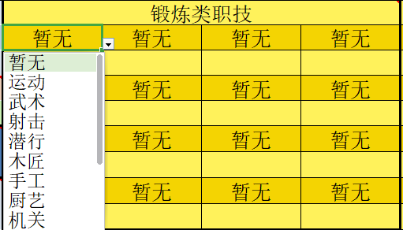
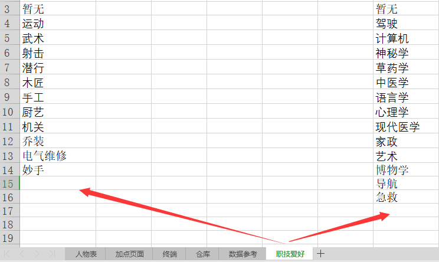

## 人物资料
import { Callout } from 'nextra-theme-docs'
import { Tab, Tabs } from 'nextra-theme-docs'
import { Steps } from 'nextra-theme-docs' 
 
<Callout type="info">
 **首先，玩家应制作创建期望的人物形象，填写人物的资本资料，具体如下表**  
 **注意，属性的填入在表格第二页【加点页面】这里仅做结果展示。**  
</Callout>

看到格子上面那个角没有，鼠标移过去或者手机点一下就能看到，大部分大家都懂的东西，我就不在这里多做废话了。（或者下次更新的时候，让其他冤大头帮我写一下诶嘿）

<Callout type="info">
- **外貌** ：对应你的性别+app属性，描述仅代表你的脸
- **体态** ：由你的身体属性加成所决定，偏差过大会导致竹竿或者臃肿身材（强度党当我没说）
- **评级** ：评级随着你跑团数和跑团结局决定，每一次评级提升都会带来实力的提升。
</Callout>

## 人物背景

人物背景：字面意思，背景越贴合世界设定，IO就越有可能根据你的背景定制初始模组

## 主要属性

基础属性会受到年龄的影响，而基础属性自身会通过不同属性产生对应的衍生属性，自身仅作用于对抗行为
以下是属性的具体描述，（ps:以下内容同样可以在卡内找到,具体位置为属性右上角的红色三角）：

<Steps>
**属性涉及的影响类型**

### 身体属性
肉体相关的属性和影响通过这些属性表达

#### 力量
力量对抗或挑战/物理束缚骰点/锻炼

#### 协调
除异能外的命中骰点/对细节要求较高的行为/锻炼

#### 代谢
毒素/代谢抵抗

#### 密度
抗击打/承受程度

#### 反应
针对突袭及突发性质行动或行动数值高于自身行动的命中行为的瞬时应对

### 精神属性
精神相关的属性和影响通过这些属性表达

#### 感知
侦查/聆听/感觉感受

#### 联想
回忆/记忆梳理/猜测/复习

#### 推演
学习/推理/理解/思考/异能远程命中

### 外貌/APP
你的外貌，只能通过骰点获得，过高过低都会产生好坏未知的影响。
<Tabs items={['0级', '1级', '2级', '3级', '4级', '5级', '6~7级', '8~9级', '10级']}>
  <Tab>
  毁容，或者极端的丑陋，属于看了晚上要做噩梦的那种   
  一般人看到正脸后需要过一个精神挑战2   
  </Tab>
    <Tab>
   较为丑陋，勉强还在可以接受的范围内吧，不过交流时可能会被排斥和拒绝      
  </Tab>
   <Tab>
   正常人的外貌，没有任何特点，平平无奇     
  </Tab>
   <Tab>
   一般社交软件上最常见的帅哥美女类型，好看，但是没啥特点      
  </Tab>
    <Tab>
    高质量人类颜值，不作死的情况下相对容易获得他人的好感      
  </Tab>
   <Tab>
    人类顶级外貌，正常人看到都需要过一次意志挑战2，失败了说不上言听计从，但是好感大增也是必然的。      
  </Tab>
   <Tab>
    人类天生的情况下可以达到的外貌极限，超过了无关堆叠的简单美学表达，在无法理解的人眼中，比外貌0还要令他恐惧，直视者需要过一次意志3挑战，失败后，会从精神层面彻底受到压制
  </Tab>
   <Tab>
    你的存在本身就是一种无法理解的模因污染，是全人类的敌人，直视你面容的人需要过一次意志5/6的挑战，失败后，彻底失去自我，沦为你的眷属
  </Tab>
   <Tab>
   凡物绝对无法承载的，只属于神明的外貌，可能对于人类来说，这只属于传说和荒谬的故事中      
  </Tab>
</Tabs>

</Steps>

<Callout type="info">
**评点**   
是角色卡提升评级的重要点数，由IO和世界主发放。   
详情可以参考[评级](./pjdj)
</Callout>

在填入属性前需要知道的知识：

- 基础属性按等级分别代表着

  **0【丧失】、1【半残】、2【正常】**
  
  **3【受训】、4【职业】、5【精英】** 
  
   **5以上为【超凡】 等级**

- 角色卡的单属性最高上限为10。

<Callout type="info"> 
**初始卡基础属性加点单项不能超过2点。**
</Callout>

## 职技属性

职技代表的是你锻炼的能力或者学习的知识

<Tabs items={['锻炼类职技', '学识类职技']}>
  <Tab>
    **锻炼类职技**: 提升后会增加用于提升身体属性的锻炼点数，一分耕耘一份收获
  </Tab>
  <Tab>
    **学识类职技**: 提升后会增加用于提升精神属性的锻炼点数，读书百遍其义自见
  </Tab>
</Tabs>

<Tabs items={['职技选择', '新增职技']}>
  <Tab>
  
  </Tab>
    <Tab>
  
  </Tab>
</Tabs>

### 职技加点

这些分配点用于分配入职技属性栏  
首先，点一下写有“暂无”的单元格，会出现下拉选项，选择你想要的职技，并在下面的单元格内写上该职技的等级。  
如果下拉选项内没有自己想要的职技，可以打开卡内的【职技爱好】表格，在该表下方空白处写上你想要的项目，然后回到此表选择。  

这里需要注意的是：
- 技能的选择必须符合人物背景；
- 请注意职技分配点点数，无需归零但不要让它为负；

<Callout type="info">
**如何获得职技点数**
所有额外获得的职技点数，都需要玩家手动输入到成长点内，而获得方法只有大世界模组和[幕间行动](../mjxd)。
</Callout> 

## 自动衍生属性

其中每个项目的意义和关联相关数据如下：

<Steps>

### Hp
当前人物的血量上限

<Tabs items={['词条', '重伤', '濒死', '肢体', '躯干', '弱点攻击', '致命攻击']}>
  <Tab>
  具体效果请参考群在线文件夹-词条&资源文件.excel或者通过骰子搜索
        
  </Tab>
    <Tab>
   单次受到半血以上伤害时，或血量低于2/3的时候，所有肢体行动-1
         
  </Tab>
   <Tab>
   血量归零后，过意志检定，通过后还能行动1回合，不通过则濒死倒地不能行动
         
  </Tab>
   <Tab>
   单个肢体耐久等于血量1/3，头颅为1/4，更小的位置如脖颈手腕等等则是1/6，针对打击超过耐久则根据攻击模式进行损坏判定，命中较小的部位需要进行命中挑战。例如：融化/骨折/断筋/断肢/粉碎/即死等……
  </Tab>
  <Tab>
   躯干耐久等于血量1/2，承伤超过耐久则进入持续掉血状态，直至死亡
         
  </Tab>
  <Tab>
   命中高于对方1点时，有对应特技或者rp的情况下，伤害1点，高于3点伤害2点
         
  </Tab>
  <Tab>
   需要单次伤害超过目标血量2/3，或者伤害大于命中的肢体部位耐久时，并且对目标进行弱点打击，比如穿刺心脏，斩首，或者类似穴位/罩门等针对性弱点打击，成功后目标直接进入濒死/死亡状态
     
  </Tab>
</Tabs>

### 运算
类似蓝条，主要通过消耗运算达到影响现实的目的

<Tabs items={['超频', '枯竭', '过载']}>
  <Tab>
  一次性消耗运算达到1/2以上，下一动无法进行精神行动
      
  </Tab>
    <Tab>
   运算降低至30及以下时，每次行动过**意志** **检定难度3** ，失败则眩晕一回合
     
  </Tab>
   <Tab>
   通过透支大脑，消耗运算上限强行进行精神行动，如果没有具体描述，则效果交由IO决定
     
   <Callout type="info">
运算上限转运算的消耗比为：1:2，此状态下你需要意志检定，具体表现为每一次透支都需进行一次意志检定，在这个过程期间会按照透支前的最后一次的【枯竭】检定，每超出挑战难度1点，额外获得1点过载检定加骰；从难度3开始，每次行动难度不断递增1点，直至失败为止，失败则直接昏迷。  
具体信息可以参考文件[关于燃烧运算](../appendix/d#关于燃烧运算)
  </Callout>
  </Tab>
</Tabs>

### 压力
也可以理解成COC里面的san值设定
具体信息可以参考文件[《附录D：压力、正面负面特质、燃烧运算规则》](../appendix/d)

<Tabs items={['临时压力', '长期压力']}>
  <Tab>
  在模组内，因为各种原因造成的压力上升，会在模组结束后减半，转化为长期压力
    
  </Tab>
    <Tab>
   持续留存的压力，需要在幕间通过不同的方式宣泄压力，如果不管的话，就会一直留存，积累满值后爆发
     
  </Tab>
</Tabs>

### 行动
一回合（3s）内，可以进行的行动次数。

分精神行动及肢体行动。

**单个目标每回合拥有1免费精神行动+X个肢体行动［具体数量见衍生属性］。**

肢体行动可一比一对换为精神行动。

在双反行动相等时：**反应**高者处于靠前的行动节点，获得先动的权利

**如果双反反应&行动相等，则处于同时行动，需要双方描述完行动后再骰点**

在双反行动相等时：**反应**高者处于靠前的行动节点，获得先动的权利

**如果双方反应&行动相等，则处于同时行动，需要双方描述完行动后再骰点**

<Tabs items={['精神行动', '肢体行动']}>
  <Tab>
  包含意志对抗以及异能启动/关闭/使用/再次使用等行为，但不包含已开启且处于持续时间的异能的维持行为，精神行动在每个回合拥有最优先启动权，可以在本回合内任意节点使用，但不可留存至下一回合。
  </Tab>
    <Tab>
   包含角色所有主动性质且对当前战斗有所影响的人物动作，甚至是张嘴，眨眼等行为，行动开始之前，根据双方【衍生属性：行动】的具体数值决定双方行动先后顺序，如果双方【行动】【反应】相等，则视为同时行动。
  </Tab>
</Tabs>

  
  

<Tabs items={['延后行动', '连续行动', '准备行动', '短距追击', '先动优势', '踱步规则', '无法行动']}>
  <Tab>
  当优先行动被角色认为行动不利时，可以通过延后行动将行动节点放置在对方行动中，或者行动后，如果放置在行动后，则需要进行一个【反应】检定对抗对方的【命中】检定，成功后行动行为不受影响，失败后自身行动结果-1检定结果。
  </Tab>
    <Tab>
   当角色行动总数大于对方1点及以上时，可进行连续行动，例【连续攻击】【招架后攻击】【闪避后攻击】【移动追击】等
         
  </Tab>
   <Tab>
   通过消耗1点行动换取下一个行动节点的行动优势，具体效果参考【词条文件】如无词条描述，则是下一个行动成功点数+1
         
  </Tab>
   <Tab>
   在1动距离内在自己移动数上下浮动1m的距离，攻击时可按移动追击判定，仅消耗1点行动点，但是额外增加0.5倍db伤害不足1时向上取整。
       
  </Tab>
  <Tab>
   在战斗中，战斗双方处于战斗开始或者非战斗戒备态势，例如多动对少动，踱步，延后行动等，优先攻击方视为突然行动，受击方需要过【反应难度2】然后根据行动对抗对方【命中】。
  </Tab>
  <Tab>
   当你在距离方面处于不利位置时，可以通过缓慢移动（最大1m/s）轻微调整距离，此行为不消耗行动点，但如果双方都进行踱步，则每过1动，选择踱步的人反应-1，选择攻击的人，视作【先动优势】。
  </Tab>
  <Tab>
   当角色行动点数消耗完毕后，目标还留有行动点数，此时无法针对对方行动进行任何行动反制。
         
  </Tab>
</Tabs>

<Callout type="info">
**行动节点**:是指一回合内，战场上每个人在一回合，即3s内， **可以行动的次数总和** 
</Callout>

在对峙双方动数不同的情况下，动数多者拥有更多的选择权，例如【先动优势】、【准备行动】、【连续行动】，动数少者则不可。

### 移动
每1点移动可在行动中移动3m距离，受到自己负重影响。

- 【贴身作战】双方距离≤3m
- 【近距离作战】双方距离≤15m
- 【中距离作战】双方距离≤30m
- 【远距离作战】双方距离≤50m
- 【超视距作战】双方距离＞50m
  **作战距离向上兼容，严谨钻空子，字写多了大家都不爱看**

<Callout type="info">
**瞄准**
中距离瞄准命中-1点，远距离瞄准命中-2点，超视距作战每10m-1点命中，每延后行动1回合增加1点命中，上限3。
</Callout>

### DB
角色在徒手攻击时，所进行的伤害检定

<Tabs items={['DB加成', '无DB加成']}>
  <Tab>
  当武器造成伤害的行为和角色力量/协调属性直接挂钩时，可以在武器伤害判定中加入db伤害，参考【挥舞型武器】【穿刺型武器】等
  </Tab>
    <Tab>
   武器造成伤害与角色力量/协调属性间接挂钩时，武器伤害不包含db判定，参考【动力臂铠】【喷气大剑】【枪械】【全自动武器】等
  </Tab>
</Tabs>

### 抗性
对于受到的伤害可以做到的抵抗程度

<Tabs items={['抗性', '无视抗性']}>
    <Tab>
   仅对物理/物质类型攻击造成伤害的抵抗能力
  </Tab>
   <Tab>
   已产生的【真实伤害】，或对已造成创伤的部位进行二次攻击。
  </Tab>
</Tabs>

### 意志
在意志对抗类的行动中，获得的成功点数加值，属于被动触发

<Tabs items={['意志对抗', '意志挑战']}>
    <Tab>
   只要受到精神类型的影响和冲击，就默认进行意志对抗，失败后受到对应效果影响
     
  </Tab>
   <Tab>
   当进行意志挑战，成功后并满足要求的前提下，将获得额外的效果加成。具体信息可以查阅[附录D：压力、正面负面特质、燃烧运算规则](./v1/appendix/d)
  </Tab>
</Tabs>

### 闪避
通过移动或者挪移行为，使角色闪避目标命中性行为的方法

<Tabs items={['完全闪避', '偏向闪避', '完美闪避']}>
  <Tab>
  需要消耗1个行动点，闪避≥命中后可以完全闪避对方攻击，不受伤害，同时可选择拉开1动距离/不拉开距离
      
  </Tab>
    <Tab>
   没有行动点时可进行微小距离的偏向闪避，一回合最多1次，闪避≥对方命中点数后，可规避致命攻击，并减少双方成功点数之差+1点伤害。闪避＞对方命中时，可以让攻击命中自身任意肢体或者躯干，让对方攻击优先命中对应位置的防具。
  </Tab>
   <Tab>
   偏向闪避大于对方命中点数3点及以上，不受到伤害。
         
  </Tab>
</Tabs>

</Steps>

## 属性变化

<Tabs items={['属性变化（事件）', '属性变化（异能）']}>
  <Tab>
  
  <Callout type="info">
**注意！**  
属性变化（事件）当中的属性加减会导致原本加点栏里的`锻炼点数`&`学识点数`产生变化，这个时候需要在属性变化（事件）的`锻炼补正`&`学识补正`里填入对应增减的点数达到原本属性的平衡。  
而此处的点数一般由世界主进行发放，特殊情况下也存在IO进行发放的可能（比如你强行作死导致被卸了第三条腿这样的情况。
</Callout>
  </Tab>
    <Tab>
  
    <Callout type="info">
  **注意！**  
属性变化（异能）是由于你个人的异能效果，如`变身`召唤`对抗点数增加`等原因需要改变自身属性来进行骰点的时候，就需要把你`变身后`召唤的物品或者生命`受到加骰影响的属性`**手动**录入到该属性栏里，然后通过自动录入功能就可以在骰点的时候输入.cc（对应属性+sp）来使用异能改变后的属性了。  
再次强调，这里的属性需要手动填写，然后交由IO审核！！不要搞错了哦！
</Callout>
  </Tab>
</Tabs>

根据我们的规则，我们可以了解到，想要提升自己的属性和衍生属性就需要通过学习职技来获得对应点数，然后加在属性栏的获得属性提升，但是跑团过程中难免会出现各种各样的意外情况导致你断胳膊断腿啊，或者是被异常情况影响导致的畸形变化，以及你自身使用异能导致的属性变化引起的整体性变动，这些情况就需要利用到这两个属性栏了。

## 特殊技能

在车制特殊技能之前，各位需要注意的是，特殊技能是我们现实中正常人类能做到的事情，现实中正常人类无法做到的事情统统归属于异能。

<Callout type="info">
**职技和特技的区分**  
- **职技** ：可以使用的点数较低，但是可以覆盖职技名称包含的绝大部分能力（会但不精）
- **特技** ：当前职技在某一种技术和能力上的熟练使用甚至是登峰造极（精但不广）
</Callout>

**特殊技能的车制规范：**

- 职技点数+基础属性点数；其中基础属性点数合计不能＞职技点数

- 特技内使用的属性总值不得超过人物属性

- 基础属性，一个特技最多加入2个，并且其中一个基础属性原有属性必须＞=3

**特技主要车制需要【职技+必须属性+（非必须属性】**
<Callout type="info">
**如果在特技中加入了联想和推演的话，每1个点数需要支付5点运算消耗**  
</Callout>

- 双职技加成一个特技的情况下，特技内的职技点数取双职技平均点数，向下取整，可使该职技获得更加宽泛的效果加成。
- 在后续的更新中，若自身的特技和现有的规则出现了冲突或变化的情况，可以申请重写特殊技能。鉴于特技为投点的机制，此项的重写可以同时更改部分其他特技，但是需要全部特技重新审核。
- 请严格按照下方的特技表格进行车制特技，希望可以自主创新的特技请在车制后名称中加入（自制）并查询审核是否可以过关。

<Callout type="info">
    **参考**  
    角色甲拥有武术4，力量5，协调3  
    角色甲想要车制战斗加伤技能，而加伤技能要求【武术+力量+（协调）】  
    则他可以选择  
    武术（4）+力量（4）=8或者武术（4）+力量（2）+协调（2）=8
</Callout>

**特别说明：特技是一个职业里某一种技术的专精，写的太宽泛和全都想要的是不可以的**
**在符合规则和自身背景的情况下，可以定制与下列表格不同的特技。**

## 特技表格
<Callout type="info">
**侦查类**
</Callout>

<Steps>

### 情报收集
探索类职技+感知+（推演）  
效果为代替感知进行侦查，收集自身感知在外界得到的信息反馈，可以在针对已知情报收集关联未知情报时，获得难度降低。

</Steps>

<Callout type="info">
**行动类**
</Callout>

<Steps>

### 高难度运动
运动或相关职技+协调+（力量）  
  例如翻滚/跑酷/攀爬等等，高难度行为，能够在对应场合申请使用，甚至是战斗中使用，但是需要消耗至少1点行动值。

### 潜行
潜行类职技+感知+协调  
  通过技巧降低自身存在感的行为，对抗属性为（感知/感知特技）甚至可以在战斗中一瞬让对战目标丢失对你的感知。

### 快速移动
运动+协调+力量（短时）/代谢（长时）  
  效果为短距离爆发冲刺，或者长距离持久奔跑，可以参考百米赛跑和马拉松，获得的速度加成不一样，应用场景也不一样。

  </Steps>

<Callout type="info">
**战斗类**
</Callout>

**攻击/招架/格挡**

<Steps>

### 攻击
武术或相关职技+协调+（力量）  
  武术仅提供最基础的伤害加成即成功点数/2伤害，需要词条效果则需要针对性职技  
  例如流血，可通过刀术/剑术等锐器操作相关职技获得。

### 招架
相关职技+协调+（力量/感知/联想）

### 格挡
相关职技+力量+（密度/协调/推演）

</Steps>

<Callout type="info">
**治疗类**
</Callout>

**伤势处理/长期恢复**

<Steps>

### 伤势处理
医学相关+联想/推演+协调（他人）/代谢（自己）  
  通过快速处理获得d2hp恢复，根据特技类型可处理对应的负面效果，如流血、感染等等  
  进行伤势处理必须携带职技相关道具。处理时间一般在10~30min之间

### 长期回复
医学相关+身体+代谢（自身）/协调（他人）（需要配合药物和设备相关）  
  面对重伤/特殊伤/断肢等无法快速处理的伤势，可以通过该特技配合药物和设备，获得特技加成+药物加成点血量回复，该效果视作按天回复。

</Steps>

<Callout type="info">
**冥想类**
</Callout> 

<Steps>

### 回复运算
代谢+感知+冥想类职技  
  消耗10min回复成功点数*15点运算值

</Steps>

<Callout type="info">
**精神类**
</Callout> 

**精神集中/对抗/意志坚定**  
**选择职技的精神类特技允许有一个合理的特殊效果**

<Steps>

### 精神集中
  意志+推演+（职技）  
  效果是代替意志检定  
  例：精神3+演算2+专注5，对抗成功后下回合受到同样精神类影响时，检定对抗+1骰

</Steps>

<Callout type="info">
**演算类**
</Callout> 

<Steps>

### 推理/理解
逻辑分析类职技+推演+（联想）  
  可以整合已知情报并分析，通过该行为推理相关未知情报  
  （IO我不想动脑了）

 </Steps>

<Callout type="info">
**社交类**
</Callout> 

<Steps>

### 交谈
APP/推演+心理学  
   可以通过该行为提升目标对你一定程度上的信任度和好感，用于快速套取情报
### 话术
联想+心理学/话术类职技  
   可以通过该行为，诱导目标说出不愿意提供的情报，答应本来不愿意答应的事情，容易在事后遭到目标的针对性行为
### 魅惑
APP+推演+就是那种类型的职技（你懂得）（外貌基础属性必须大于4）  
   啊这…………还要我解释？挑战过了想睡谁睡谁。
### 恐吓
app/推演/联想+心理学/带有威胁性职技（车恐吓外貌要么低于2要么大于4）  
   你和正常人不一样，从里到外，你带来的恐惧是发自内心的，被你破防的对象会把第一次打飞机是在几岁都告诉你。

</Steps>

<Callout type="info">
**工艺类**
</Callout> 

<Steps>

### 道具制作
协调+联想/推演+手工相关职技+对应工具/设备  
  可以通过该职技，在某一个方向制作专精类型的道具，如果是短时间内制作一些复杂的道具，除非你大成功，不然这玩意基本都是一次性的。
### 武器维护
协调+（力量/联想）+锻造类职技+对应工具/设备  
  可以通过该行为恢复道具的耐久度，模组内使用该特技可以回复少量耐久（类似用磨刀石磨刀），幕间使用可以大量回复道具耐久。

 </Steps>

<Callout type="info">
**电子信息类**
</Callout> 

<Steps>

### 编程/破解入侵
计算机+联想+推演  
虽然设计职技和属性相同，但是效果不一样，基本上就是字面意思。

</Steps>

## 随身装备

<Tabs items={['装备', '背包']}>
  <Tab>
  
  </Tab>
    <Tab>
  
  </Tab>
</Tabs>

把自己想要的装备填写在“背包及装备”一栏，初始持有的物品须符合人物背景。

所填装备需要填入合适的重量

这里需要注意的是：

- 背包的位置需要填写在装备中，重量为0.5
- 请不要再装备重量栏里添加单位，单位全部转化为kg换算

## 收支记录

这里纪录的是你在跑团过程中，一个幕间（一个月）内的收入和支出，浮动代表rd判断具体金额，但是这个可以自动录入，你们只要将数值填入进去就好。

## 属性录入

类似于coc规则，你的所有数据将会被记录在“属性记录”槽中

“支出记录”槽将会记录“收支记录”内容中的数据，计算你的pt

<Callout type="info">
在录入卡时， **请先将“属性记录”中的内容长按到下方的空白txt文本框中** ，然后再复制到qq中录入。若出现错误，请确认是否有内容出现了记录失误，若仍然出现错误， ~请尝试重启电脑，~ 请寻找主持人或其他pl进行帮忙。注意在帮忙时学习如何进行录入而不是单纯的寻找他人代劳。~~
</Callout> 

